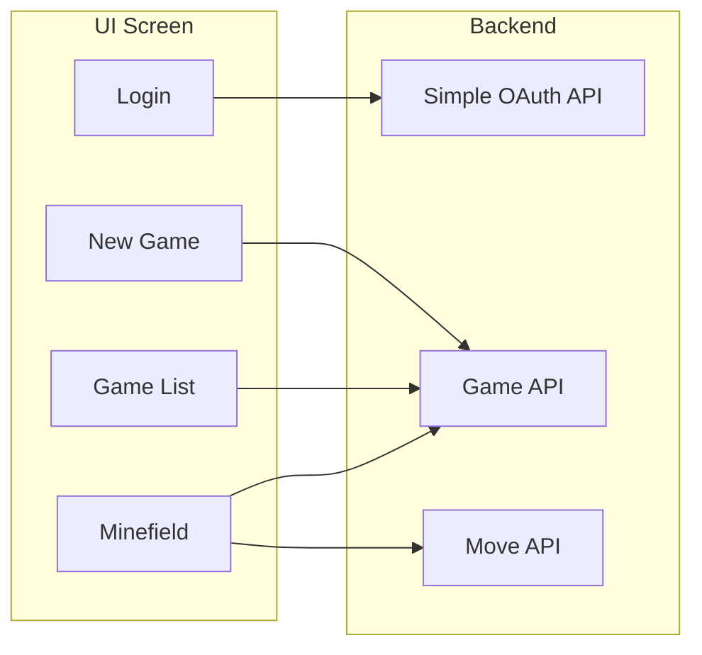

# Minesweeper with Django and React

## Features

* A simple Minesweeper game that automatically saves your progress to the server.
  * Allow players to resume their own games.
* Responsive Design - Almost mobile friendly.


## Code design



## How to run with Docker

### Requirements

* Docker
* PostgreSQL client (`psql`)

### Getting started

1. Make your own copy of `.env.dist` as `.env`.
   * Please reconfigure the file (`.env`) as needed. See the comment for tips.
   * The `.env` is used by the setup script and the backend.
   * Only `POSTGRES_HOST` and `POSTGRES_PORT` are for connecting from the host machine to the database server.
   * For example,
     ```properties
     # NOTE: Run "openssl rand -hex 24" to randomly generate
     JWT_SECRET=661c190e...f2b
     POSTGRES_HOST=127.0.0.1
     POSTGRES_PORT=35432
     # NOTE: Run "openssl rand -hex 24" to randomly generate
     POSTGRES_PASSWORD=b610932f7...adc2
     # NOTE: Run "openssl rand -hex 8" to randomly generate
     POSTGRES_USER=fd5605...f55
     ```
2. Run `make docker-start` to start all services.
   * After everything is running, the app is accessible at http://localhost:3000
3. As the app requires Django users, please run `make docker-superuser` to create your own account.

## Known issues

### Code Design or Implementation

* Lack of proper error handling.
* For simplicity, the authentication should be re-implemented.
  * Currently, the client-credentials OAuth2 authentication is implemented where Django User's username and password are client ID and secrets respectively.
* CSRF is disabled for simplicity.

### Deployment

* For simplicity, the deployment setup is using the developer's setup.
  * This setup requires ports 3000 for the UI and 8000 for the backend service.
  * Run as root.